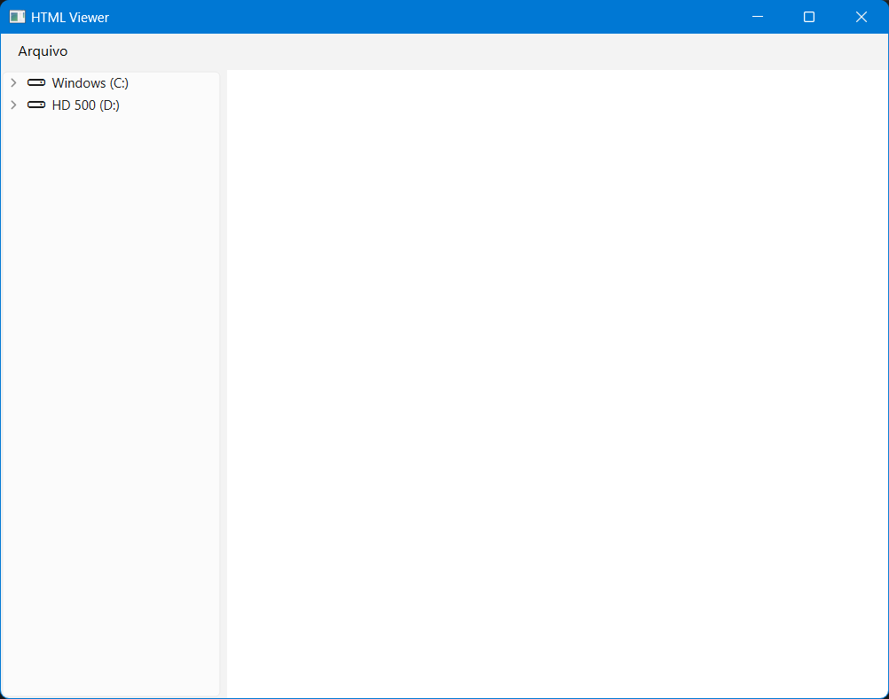

# HTML Viewer with Directory Navigation

[](https://python.org)
[](https://pypi.org/project/PySide6/)

Um visualizador de HTML com navegação de diretórios integrada, desenvolvido em Python com interface gráfica PySide6.

 <!-- Adicione uma screenshot real -->

## ✨ Funcionalidades

- 🗂️ Navegação hierárquica de diretórios
- 🔍 Filtro automático para arquivos HTML
- 🌐 Visualizador integrado com suporte a:
  - HTML5 completo
  - CSS3
  - JavaScript
  - WebEngine moderno
- 🔗 Navegação bidirecional (árvore ⇄ conteúdo)
- 📂 Abertura de diretórios via interface gráfica
- ⚡ Desempenho otimizado para grandes estruturas de diretórios

## 📦 Instalação

### Pré-requisitos
- Python 3.8+
- pip

### Passo a passo
```bash
# Clonar repositório
git clone https://github.com/psyrobss/htmlViewer.git
cd htmlViewer

# Instalar dependências
pip install -r requirements.txt
```

## 🚀 Como Usar

1. Inicie o programa:
```bash
python html_viewer.py
```

2. Na interface:
   - Clique em `Arquivo > Abrir Diretório` para selecionar uma pasta
   - Navegue pela árvore de diretórios à esquerda
   - Clique em arquivos `.html` para visualizar
   - Use os links dentro do HTML para navegar entre arquivos

### Atalhos
- `Ctrl+O`: Abrir diretório
- `F5`: Recarregar diretório atual
- `Esc`: Sair do programa

## 🛠️ Personalização

### Themes (Adicione no CSS)
```python
# No código, após criar a MainWindow
self.setStyleSheet("""
    QMainWindow {
        background-color: #f0f0f0;
    }
    QTreeView {
        font: 12px "Arial";
    }
""")
```

### Configurações Avançadas
- Alterar extensões filtradas: Modifique a classe `HtmlDirFilterProxy`
- Tamanho inicial da janela: Ajuste em `self.setGeometry(100, 100, 800, 600)`

## ❗ Troubleshooting

**Problema**: Erro ao importar PySide6
- **Solução**: Verifique a instalação com `pip show PySide6`

**Problema**: Arquivos HTML não carregam
- **Solução**: Certifique-se que o caminho não contém caracteres especiais

## 🤝 Como Contribuir

1. Faça um Fork do projeto
2. Crie sua Branch (`git checkout -b feature/nova-feature`)
3. Commit suas mudanças (`git commit -m 'Add new feature'`)
4. Push para a Branch (`git push origin feature/nova-feature`)
5. Abra um Pull Request

## 📄 Licença

Distribuído sob licença MIT. Veja `LICENSE` para mais informações.

---

**Desenvolvido com ❤️ por psyrobss** - [psyrobs@gmail.com](mailto:psyrobs@gmail.com)